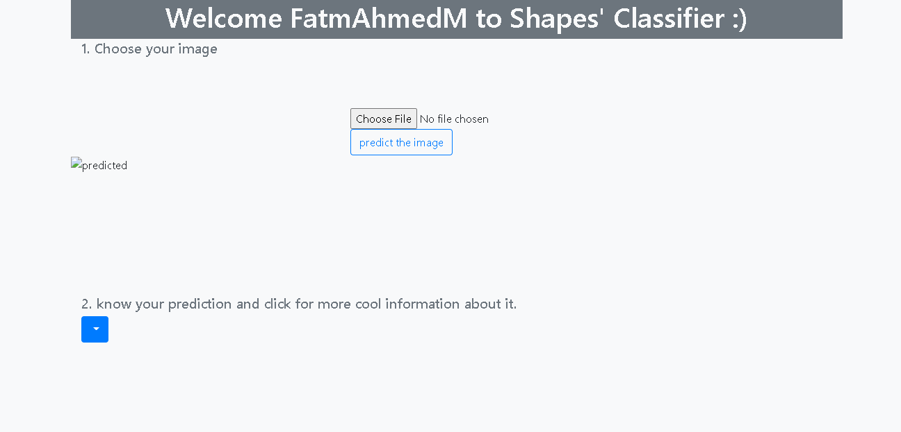

# Shapes-_Classifier
This is a simple deeplearning classifier app made by flask framework.

The data source for the model: https://www.kaggle.com/cactus3/basicshapes

**This repo is ready for being hosted by websites and when hosted, gives the following result:**

**1.**

**2.**

**3.**

**4.**

